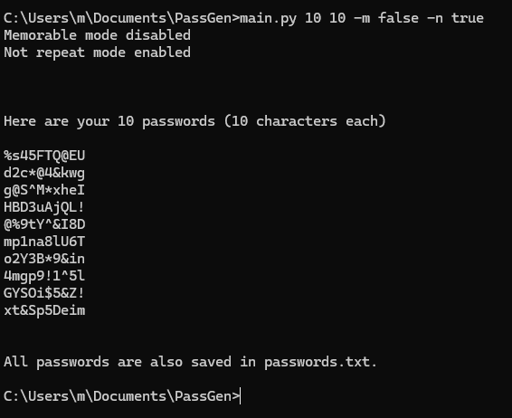
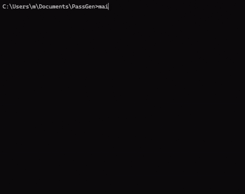

 


# Password Generator

A simple Python CLI tool for generating random passwords.  
It can generate multiple passwords, create memorable passwords using words, and generate passwords without repeating characters.

All generated passwords are also saved to a file.

## Features

- Generate multiple passwords at once
- Custom password length
- Optional memorable mode using readable words
- Optional not repeat mode that prevents character repetition
- Automatically saves generated passwords to `passwords.txt`
- Works both with command-line arguments and interactive input

## Requirements

- Python 3.x

No external libraries are required.

## Installation

Download or clone the project and make sure both files are in the same directory:

```
main.py
generator.py
```

## Usage

### Command Line Mode

Run the script with parameters:

```
python main.py <length> <count> [options]
```

Example:

```
python main.py 12 5
```

This generates **5 passwords** with **12 characters each**.

### Options

Enable memorable mode:

```
-m True
```

Example:

```
python main.py 12 5 -m True
```

Enable not repeat mode:

```
-n True
```

Example:

```
python main.py 10 3 -n True
```

### Important

Memorable mode and not repeat mode **cannot be used together**.

Example of invalid usage:

```
python main.py 12 5 -m True -n True
```

## Interactive Mode

If no arguments are provided, the program will ask for input:

```
python main.py
```

You will be prompted to enter:

- password length
- number of passwords
- enable memorable mode (True/False)
- enable not repeat mode (True/False)

## Limits

- Password length: **3 to 512 characters**
- Maximum number of passwords: **256**
- Not repeat mode maximum length depends on available characters

## Output

Generated passwords are:

- printed in the terminal
- saved to `passwords.txt`

Example file content:

```
=== passwords 2026.3.14 12:30 ===
A8F!K2QW9
TREE!MOON8
```

## Project Structure

```
main.py        CLI interface and argument parsing
generator.py   password generation logic
passwords.txt  saved generated passwords
```

## License

Free to use and modify.
